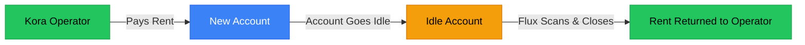

# Flux: Kora Rent Guardian

## The Problem

Solana accounts are not free. They cost "Rent" (storage fees). When you abandon an account, that SOL is locked forever.

Think of it like Tupperware.

When you open a Solana account, you're essentially buying a container to hold your data. You pay a deposit (rent) to reserve that space. When the data inside is no longer needed—the account goes idle—you *should* return the container and get your deposit back.

Most people forget. The containers pile up. The SOL stays locked.

**Flux returns the containers.**

---

## What is Kora?

Kora is a transaction sponsorship service for Solana. It lets apps pay transaction fees and account creation costs on behalf of their users.

### How Kora Sponsors Accounts

When a user needs to create a new account (like a token account), the app can ask Kora to pay the costs:

1. **User initiates action** (e.g., receive a token for the first time)
2. **Kora operator pays the rent** (SOL locked as a storage deposit)
3. **Account is created** (user can now receive tokens)
4. **User never pays a fee** (better UX, app covers the cost)

### Where Rent Gets Locked

Every time Kora sponsors an account creation, SOL gets locked:

| Account Type | Typical Rent | Purpose |
|--------------|--------------|---------|
| Token Account | ~0.002 SOL | Holds user tokens |
| Associated Token Account | ~0.002 SOL | Standard token wallet |
| Custom Program Account | Varies | App specific data |

Over time, operators sponsor thousands of accounts. Many become inactive. The SOL stays locked.

### The Problem for Operators

- Users abandon accounts after transferring tokens out
- Apps shut down but accounts remain open
- Nobody is tracking which accounts are still needed
- Operators lose capital to "rent leak" without realizing it

### How Flux Solves This

Flux monitors all accounts sponsored by a Kora operator and:

1. **Scans** for inactive sponsored accounts
2. **Judges** each account (is it safe to close?)
3. **Reclaims** the rent when safe, returning SOL to the operator



---

## The Solution

Flux is a dashboard that monitors and reclaims rent from idle Kora-sponsored accounts. It consists of three modules:

| Module | What It Does |
|--------|--------------|
| **Scanner** | Finds all accounts sponsored by your operator wallet. Identifies which ones are idle and eligible for reclamation. |
| **Judge** | Checks safety rules before any action. Makes sure we never close an account that still has active data. |
| **Executioner** | Actually closes the accounts and returns the rent to the operator. Only runs after the Judge approves. |

---

## Submission Checklist

This table shows how Flux meets the hackathon requirements.

### Security & Safety

| Requirement | Status | How We Handle It |
|-------------|--------|------------------|
| Never close accounts with active data | ✅ Done | `judge.ts` checks lamports = 0 and data is empty before approval |
| Simulation mode for safe testing | ✅ Done | Toggle in settings enables "dry run" - logs what would happen without doing it |
| Clear logging of all actions | ✅ Done | Every scan, judgment, and reclaim is stored in the database with timestamps |

### User Experience

| Requirement | Status | How We Handle It |
|-------------|--------|------------------|
| Works without wallet setup | ✅ Done | Mock Mode loads demo data automatically |
| One-command startup | ✅ Done | `npm run dev` handles database setup and starts the app |
| Clean, readable interface | ✅ Done | Dark mode dashboard shows stats, accounts, and activity logs |

### Technical

| Requirement | Status | How We Handle It |
|-------------|--------|------------------|
| Devnet compatible | ✅ Done | Default RPC is Solana Devnet |
| Mainnet ready | ✅ Done | Just change `SOLANA_RPC_URL` in `.env` to go live |
| Persistent storage | ✅ Done | SQLite via Prisma stores all accounts and logs locally |

---

## Quick Start

### The One-Command Promise

```bash
git clone <repo-url>
cd flux
npm run dev
```

> **Note:** This command handles the full setup for you. It installs the tools, creates the database, and loads demo data so you can start testing immediately.

Open [http://localhost:3000](http://localhost:3000) to see the dashboard.

### Mock Mode

Don't have a wallet? No problem.

If you don't set the `OPERATOR_PRIVATE_KEY` environment variable, the app launches in **Mock Mode**. This means:

-  The dashboard loads with demo data
-  All buttons and features work
-  You can see exactly how the UI behaves
-  No real Solana transactions happen

This is perfect for judges who want to test the interface without setting up wallets or connecting to Solana.

---

## Testing with a Real Wallet (For Judges)

> **Security Warning:** Only use a **burner wallet** with no real funds. Never use your main wallet's private key.

### Why We Use Plain Private Keys

The most secure approach would be an encrypted keystore protected by a password. We didn't use this because automation requires zero friction. If the key were locked behind a password, the bot would get stuck waiting for human input every time it tried to run a scan, which defeats the purpose of an "automated" tool.

For a hackathon demo, a burner wallet is the safest approach.

### Steps to Test Live Mode

**Step 1: Create a Burner Wallet**

- Use Phantom, Solflare, or any Solana wallet to create a new wallet
- Export the private key (keep it secret, never share it)
- Copy the wallet address (this is your public key)

**Step 2: Configure the Environment**

- Open the `.env` file in the project root
- Add your keys in this exact format:

```env
OPERATOR_PUBLIC_KEY="YourWalletAddressHere"
OPERATOR_PRIVATE_KEY="YourPrivateKeyHere"
```

- Save the file

**Step 3: Restart the Server**

- Stop the running server by pressing `Ctrl + C` in the terminal
- Start it again:

```bash
npm run dev
```

**Step 4: Open the Dashboard**

- Go to [http://localhost:3000](http://localhost:3000)
- By default, you will see **14 simulated demo accounts**

**Step 5: Switch to Live Mode**

- Toggle "Simulation Mode" **OFF** (switch turns amber/warning color)
- Click **"Scan Now"**
- The dashboard will scan your real wallet on Solana Devnet

**Step 6: Interpret the Results**

- **New or empty wallet?** Expect **0 accounts**. This means the connection is working, there is just nothing to find yet.
- **Wallet with history?** You will see any accounts your wallet has sponsored.

**Step 7: Switch Back to Simulation**

- Toggle "Simulation Mode" back **ON**
- Click **"Scan Now"** again
- The 14 demo accounts will be restored automatically

---

## Network Options

| Network | RPC URL | When to Use |
|---------|---------|-------------|
| Devnet | `https://api.devnet.solana.com` | Testing with fake SOL |
| Mainnet | `https://api.mainnet-beta.solana.com` | Production (real money) |
| Custom | Your Helius/QuickNode URL | Better rate limits |

---

## Tech Stack

- **Frontend:** Next.js 16, React 19, TypeScript, Tailwind CSS
- **Backend:** Next.js API Routes
- **Database:** SQLite + Prisma ORM
- **Blockchain:** Solana Web3.js

---

## Project Structure

```
flux/
├── src/
│   ├── app/              # Next.js pages and API routes
│   │   ├── api/          # Backend endpoints
│   │   │   ├── scan/     # Trigger account scanning
│   │   │   ├── reclaim/  # Execute rent reclamation
│   │   │   ├── accounts/ # Fetch stored accounts
│   │   │   ├── logs/     # Fetch activity logs
│   │   │   ├── stats/    # Get dashboard statistics
│   │   │   └── settings/ # Manage app settings
│   │   └── page.tsx      # Main dashboard
│   ├── components/       # React components
│   └── lib/              # Core modules
│       ├── scanner.ts    # Account discovery
│       ├── judge.ts      # Safety verification
│       └── executioner.ts # Rent reclamation
├── prisma/
│   ├── schema.prisma     # Database schema
│   └── seed.ts           # Demo data for Mock Mode
└── .env.example          # Configuration template
```

---

## License

MIT
